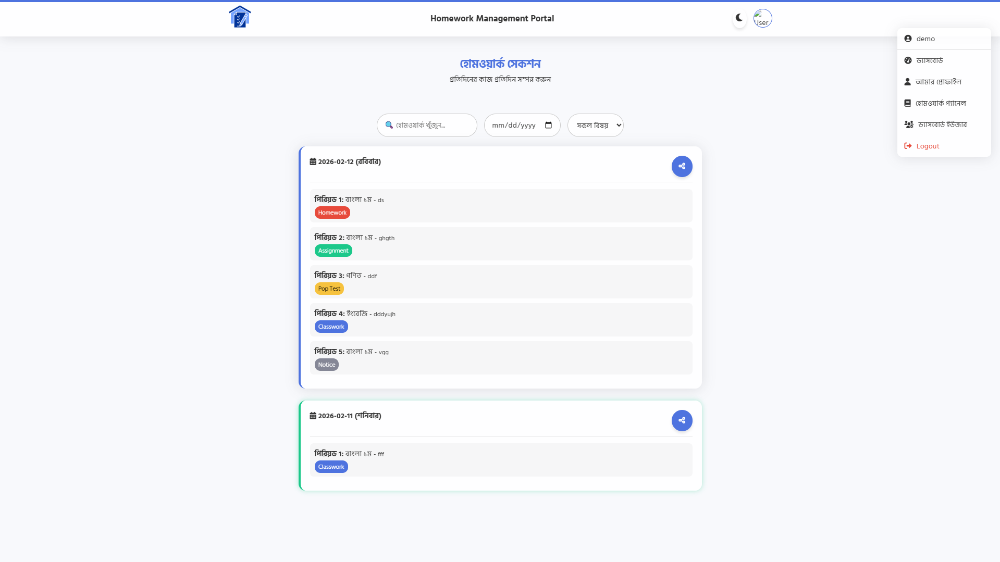

# 📚 Homework Management Portal

A comprehensive homework management system for School or College. This web application allows students to view daily homework assignments, filter by subject and date, search for specific tasks, and helps teachers manage homework submissions through an admin panel.

## 🔒 Auth Info
- **User** — demo@gmail.com
- **Password** — 123456

## ✨ Features

### 🎯 Core Features
- **Firebase Integration** — Authentication & Firestore database
- **Real-time Updates** — Homework appears instantly when added
- **Search & Filter** — Find homework by subject, date, or keywords
- **Dark/Light Mode** — Toggle theme for comfortable viewing
- **Responsive Design** — Works on desktop, tablet, and mobile
- **Admin Panel** — Teachers can add/edit/delete homework
- **User Authentication** — Secure login for students and teachers
- **Push Notifications** — Webpushr integration for homework alerts

### 📋 Homework Management
- View daily homework with subject, description, and deadline
- Filter by subject (Bengali, Math, English, Science, etc.)
- Filter by specific date
- Search homework by title or description
- Status indicators (pending, submitted, overdue)

### 👥 User Roles
- **Students** — View homework, mark as completed
- **Teachers** — Create, edit, delete homework assignments
- **Admin** — Full access, user management

## 🛠 Technologies Used

- **HTML5** — Semantic markup
- **CSS3** — Custom properties, Flexbox, Grid
- **JavaScript (ES6+)** — DOM manipulation, async/await
- **Firebase 8.10.0** — Authentication, Firestore database
- **AOS Library** — Scroll animations
- **Font Awesome 6** — Icons
- **Webpushr** — Push notifications
